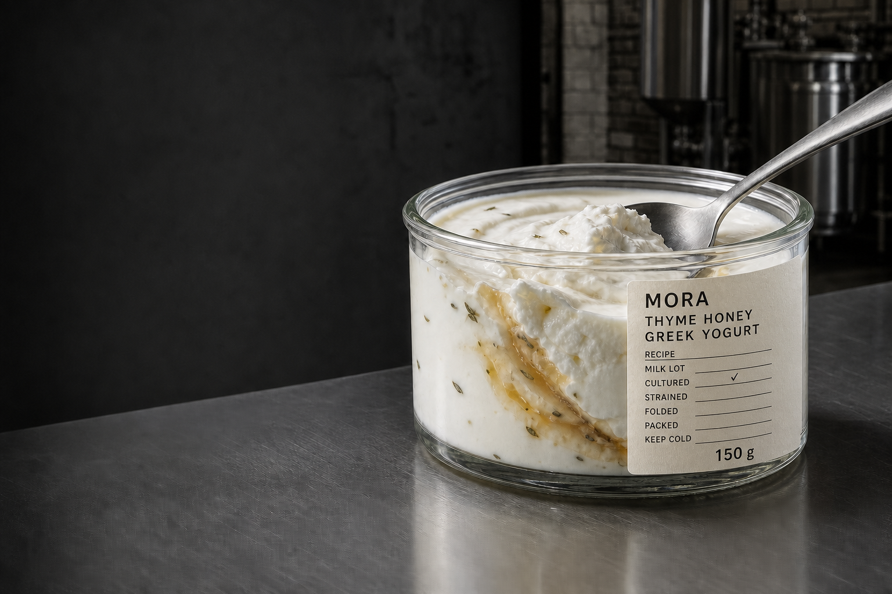
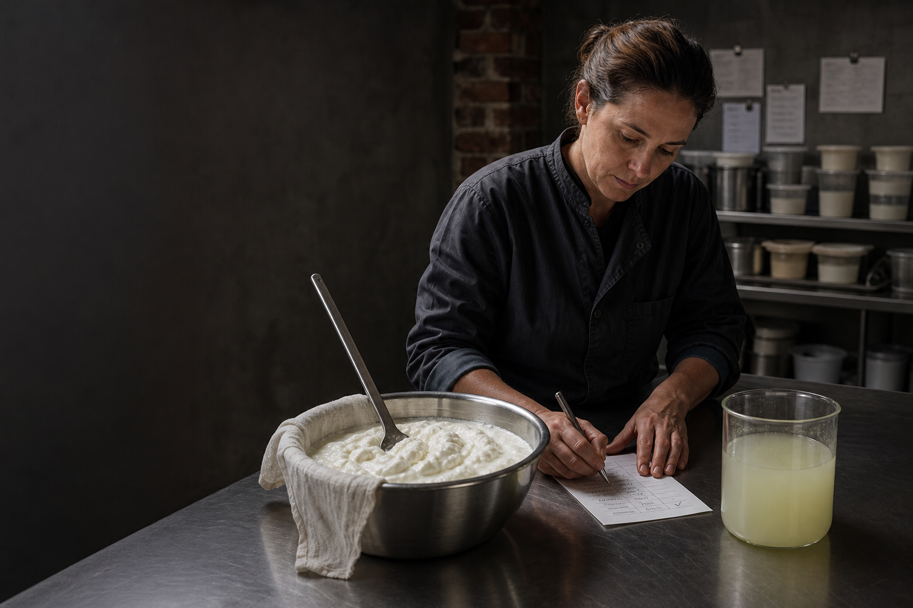

# MORA — Extended Brand Anatomy, Revision 10

르라보의 장인정신을 표면적으로 닮는 것이 아니라, **재료·노동·기록이 신뢰를 만드는 구조**만 식품 문법으로 전환한다. MORA의 주체는 사회적 클리셰로 소비되는 ‘여성성’이 아니라 가족의 미식을 책임지고, 재료를 엄선하며, 마지막 상태까지 확인하는 상징적 여성 메이커 **The Keeper of Taste — 끝까지 보는 사람**이다.

## 1. Source Grammar Application

| S1에서 확인한 원리 | S1 사진 제목 | MORA 전환 규칙 |
|---|---|---|
| 라벨과 규격 정보가 장식보다 먼저 신뢰를 만든다 | Personalized label application · Classic Collection family tile · SANTAL 26 candle label detail | 향수 라벨을 복제하지 않고, 식품 고유의 **Batch Record**로 전환한다. 레시피·우유 로트·배양·스트레이닝·폴딩·포장·냉장·중량을 규격 정보로 남기고, 실제 확인 행위만 제한적으로 손으로 표시한다. |
| 노동과 중간 과정이 완성품의 근거가 된다 | Sandalwood Harvest film poster · Rose Harvest film poster · Fresh formulation / refill pour · Diffuser craft motion poster, Brooklyn | 원재료 선별부터 배양, 분리, 인퓨전 보관, 마지막 폴딩, 최종 확인까지를 숨기지 않는다. 한 장면에는 입력물·도구·행동·중간 산출물·기록을 함께 둔다. |
| 오래 쓰인 기능적 공간이 브랜드의 시간성을 증명한다 | Roots first lab · Le Labo laboratory-store interior · About-page lab workwall banner | 어두운 벽돌과 실링된 콘크리트 제조실을 기본 무대로 삼되, 식품 접촉부는 깨끗한 스테인리스로 분리한다. 빈티지는 오염이 아니라 축적된 사용감으로 표현한다. |
| 제품군은 한 규율 아래 차이를 드러낸다 | Classic Collection family tile · Discovery Set package | 동일한 저상형 와이드 마우스 병과 Batch Record 체계를 유지하고, 실제 재료만 SKU별 색과 질감 차이를 만든다. |

르라보의 ‘남성 장인’ 이미지를 S1 사실로 과장하거나 MORA에 그대로 이식하지 않는다. 여성 메이커는 MORA가 새로 세우는 타깃 고유 문법이며, 아름답게 차려진 주방 이미지가 아니라 **선택하고, 비교하고, 멈추고, 기록하는 권한**으로 보인다.

## 2. Brand Positioning

- Category: Female-led premium craft Greek yogurt
- Human archetype: **The Keeper of Taste — 끝까지 보는 사람**
- Craft method: **Measured Transformation — 측정 가능한 변환**
- Brand spirit: **The Last Measure — 마지막 한 번의 집요함**
- Product system: **MORA Batch Record Greek Yogurt**
- Key visual: **Material Under Care — 돌봄 아래 놓인 재료**

MORA는 ‘좋은 재료를 쓴 요거트’에서 멈추지 않는다. 좋은 재료를 고르는 책임, 발효와 분리를 보이는 투명성, 맛과 질감이 기준에 도달할 때까지 끝까지 보는 정확성을 판다. 엄마·아내·주방의 주인이라는 상징은 성 역할의 처방이 아니라, 타인의 식탁까지 책임지는 미식적 판단력의 문화적 기억으로만 사용한다.

## 3. Product Concept & Product Lineup

모든 제품은 150g 투명 저상형 와이드 마우스 병에 담긴다. 병은 향수처럼 목이 좁지 않고 숟가락이 자연스럽게 들어가며, 전면의 60–70% 이상에서 실제 요거트와 재료가 보여야 한다. 무코팅 종이 Batch Record는 병을 부분적으로만 감싸고 법정 표시는 별도 표준 영역에 둔다.

| Product | Recipe role | Visible proof |
|---|---|---|
| MORA Thyme Honey | 허브성 꿀을 마지막 단계에 접어 넣는 대표 제품 | 꿀의 반투명한 결, 마지막 폴딩 기록 |
| MORA Fig Leaf | 식용 적합성과 레시피 검증 전에는 출시하지 않는 조건부 방향 | 허용 부위·준비법·안전성이 승인된 경우에만 실제 중간상태와 기록을 연결 |
| MORA Roasted Buckwheat | 볶은 메밀을 토핑이 아닌 내부 입자로 남기는 레시피 | 두 깊이에 남은 곡물 입자와 로스팅 배치 |
| MORA Citrus Peel | 검증된 껍질 인퓨전 또는 짧은 실제 peel thread로 밝기를 만드는 레시피 | 인공 색면이 아닌 실제 zest·thread와 준비 기록 |
| MORA Black Sesame | 검은깨 페이스트를 한 번 접어 밝은 몸과 짙은 결을 함께 남기는 레시피 | 아이보리–회색 마블, 실제 씨앗 입자와 폴딩 경계 |
| MORA Olive Oil & Sea Salt | 올리브오일과 소금을 먹기 직전 균형으로 마감 | 표면의 오일 광택과 최종 계량 기록 |

제품의 핵심은 ‘예쁘게 스타일링한 디저트’가 아니라 먹을 수 있는 중간 산출물과 판단 기록이 한 용기 안에서 만나는 것이다. 대표 앵커는 **MORA Thyme Honey Batch Record Jar**로 고정한다.

## 4. Verbal Identity & Brand Storytelling

브랜드 메시지는 **“좋은 재료를 고르는 데서 끝나지 않습니다.”**이다. 이를 세 가지 가치로 전개한다.

- 엄선하는 책임: 승인된 원료 후보와 배치 상태를 비교해 오늘 쓸 재료를 고른다.
- 보이는 변환: 배양·분리·인퓨전·폴딩의 상태를 감추지 않는다.
- 마지막까지 보는 정확성: 질감과 산미가 기준에 도달할 때 포장한다.

창업자 서사는 전기적 사실을 꾸며내지 않는다. ‘가족의 식탁을 맡아 온 사람의 판단을 제조 규율로 확장했다’는 인과만 사용하고, 실제 인물·연도·지역·가족관계는 검증되기 전까지 공개 서사에 넣지 않는다.

플래그십은 판매점보다 **기록이 남는 제조·큐레이션 공간**으로 기능한다. 고객 개인화는 향수식 이름·도시·날짜 의식을 복제하지 않고, 실제 제조 배치와 확인자의 제한된 체크를 통해 제공한다. 중간 산출물 아카이브는 우유 로트, 분리된 유청, 인퓨전 상태, 마지막 폴딩 전후를 비교해 보여준다.

## 5. Visual Branding & Key Visual System

키 비주얼 **Material Under Care**는 한 장면에 하나의 재료, 하나의 도구, 하나의 결정적 행동, 하나의 중간 산출물, 하나의 기록만 둔다. 재료는 깨끗하지만 지나치게 연출되지 않고, 손은 장식이 아니라 선택과 확인의 주체로 등장한다.

대표 제품 이미지는 저상형 와이드 마우스 병, 노출된 실제 내용물, 부분 부착된 Batch Record, 숟가락이 남긴 물리적 자국을 색 정확도가 높은 중성광에서 증명한다.

## 6. Brand Mood & Imagery

브랜드 무드는 **The Keeper’s Manufactory**다. 어두운 흑연색 그림자, 오래된 벽돌, 실링된 콘크리트 외피 안에 위생적인 스테인리스 작업대를 둔다. 여성 메이커는 카메라를 보며 웃거나 요리 생활상을 연기하지 않는다. 서로 다른 발효·분리 상태를 비교하고, 기준 미달이면 멈추며, 확인 뒤 기록한다.

분위기 사진은 어둡고 앰비언트하지만 음식과 손의 상태가 뭉개지지 않아야 한다. 녹슨 식품 접촉면, 홈 키친, 핑크·플로럴 여성성, 백의 실험실, 향수 플라스크 문법을 금지한다.

## 7. Product & Process Visualization

제조 과정은 **Selection → Culturing → Separation → Infusion Archive → Last Fold → Packaging / Final Check**의 여섯 단계로 시각화한다.

- Selection: 승인된 원료 후보와 우유 로트를 비교하고 선택 근거를 남긴다.
- Culturing: 시간과 온도로 배양 상태를 기록한다.
- Separation: 농밀한 베이스와 반투명 산성 유청을 함께 보여준다.
- Infusion Archive: 허브·잎·과실·견과가 맛으로 이동하는 중간 상태를 보존한다.
- Last Fold: 재료가 완전히 사라지지 않도록 마지막에 접어 넣은 결을 보여준다.
- Packaging / Final Check: 넓은 입구의 병에 담고 질감·중량·냉장 상태를 확인한다.

과학성은 비커와 피펫 같은 소품이 아니라 시간, 온도, 무게, 로트, 전후 상태의 비교에서 나온다. 장인성은 불규칙한 손글씨 장식이 아니라 기준을 충족할 때까지 반복해서 보는 판단에서 나온다.

## 8. Design Tokens & Boundaries

색은 Graphite, Sealed Concrete, Cultured Milk White, Oxidized Steel, Food-contact Stainless, Uncoated Paper를 기본으로 하고 SKU 색은 실제 식재료에서만 가져온다. 활자는 기술 정보를 담당하는 절제된 산세리프와 제품명을 위한 단단한 디스플레이 계층을 사용한다. 손글씨 폰트는 쓰지 않고 실제 확인자의 제한된 체크·이니셜만 변동 요소로 둔다.

레이아웃은 높은 정보 밀도와 넓은 식품 노출 면적을 공존시키며, 코너 반경은 0–4px 범위의 낮은 곡률로 제한한다. Le Labo 워드마크, Ingredient + Number 네이밍, 동일한 약국식 라벨, 향수병 실루엣, 도시·날짜 의식, 선언문 문장 리듬, Le Journal 형식은 사용하지 않는다.

---

Review target: 여성 메이커의 책임이 장식적 여성성이 아니라 판단 권한으로 읽히는지, 제조실의 어둠과 식품 위생이 동시에 성립하는지, Batch Record 병이 르라보 복제품이 아닌 MORA의 식품 기록체계로 보이는지 확인한다.
