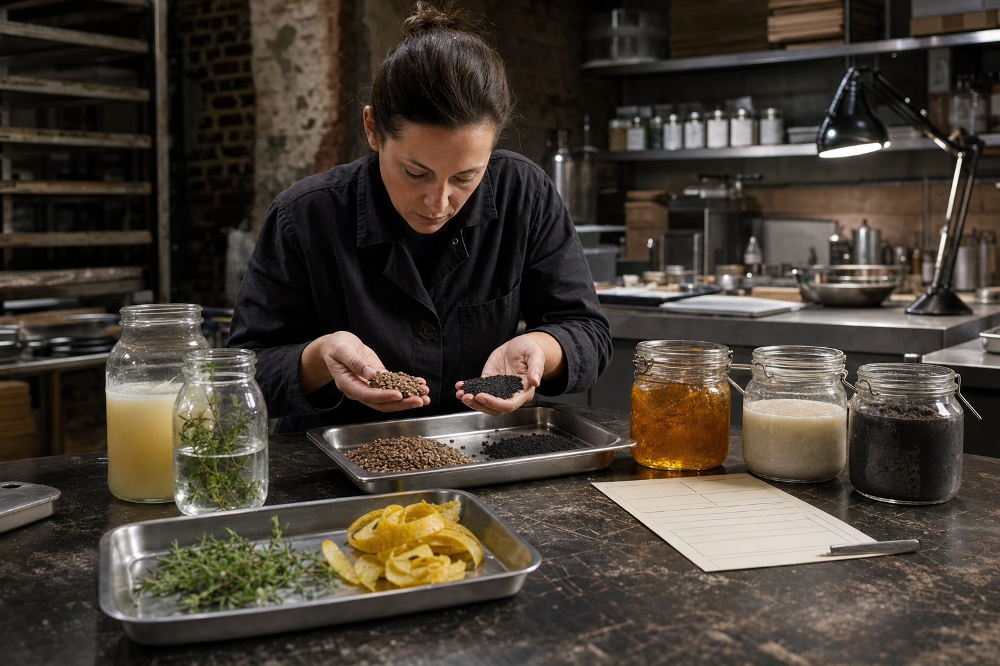
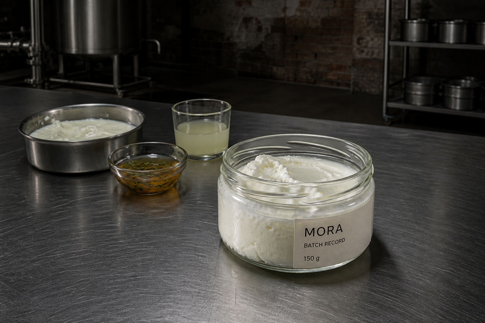
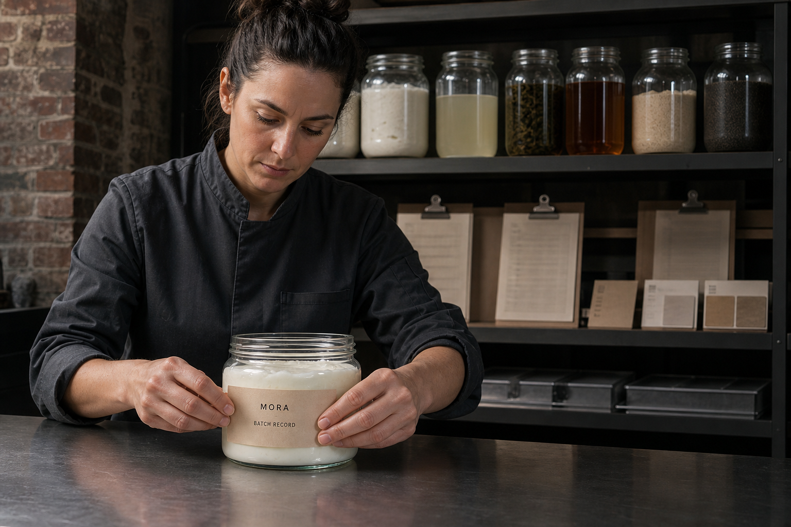
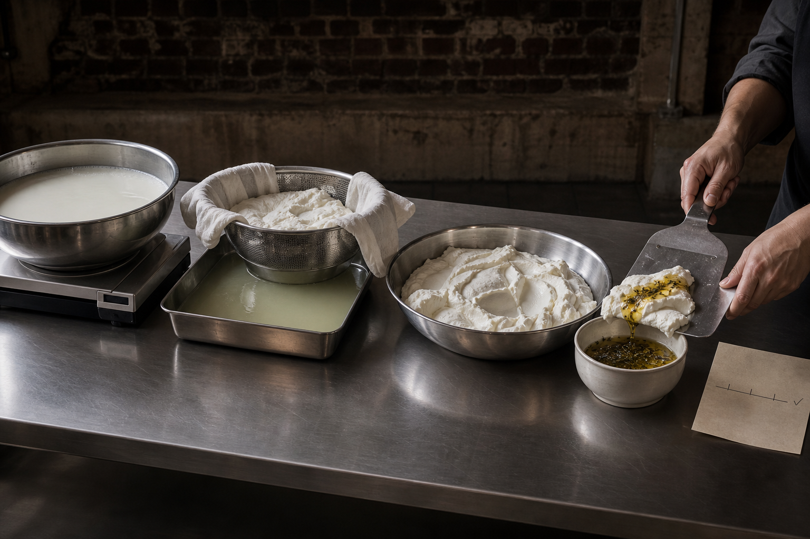
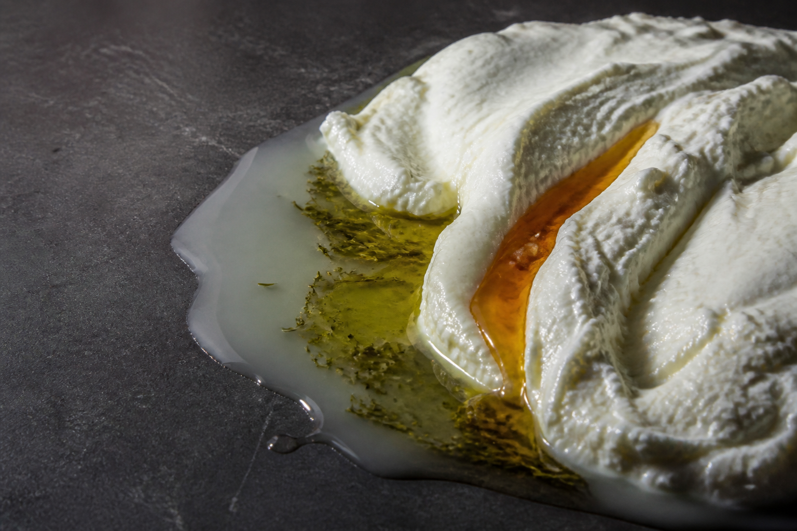

# MORA Revision 11 — Fast Mood Check

빠른 방향 확인용 이미지다. 피드백별 대표 무드를 1:1로 확인하며, 세부 패키징·공정·문자 정확성은 다음 지시 이후 조정한다.

| Feedback | Representative image | Direct visual job |
|---|---|---|
| 1. 거칠고 빈티지한 재료·수집·제조·큐레이션 |  | 여성 메이커가 정돈되지 않은 작업 흔적 속에서 원재료와 중간상태를 비교·선택한다. |
| 2. 어두운 제조실·실험실과 Batch Record 용기 |  | 벽돌·콘크리트 제조실, 넓은 입구의 투명 병, 보이는 내용물과 부분 종이 기록지를 한 장면에 묶는다. |
| 3. 개인 라벨·플래그십·중간 산출물 컬렉션 |  | 플래그십 작업대에서 개인 Batch Record를 붙이고 뒤편에는 중간 산출물 아카이브가 이어진다. |
| 4. 과학적·장인적 제조 과정 |  | 배양·분리·인퓨전·폴딩·기록이 실제 식품 상태와 도구를 통해 한 인과로 보인다. |
| 5. 재료 순수성과 변환 기반 키 비주얼 |  | 농밀한 요거트, 유청, 타임 인퓨전, 꿀의 fold를 앰비언트한 물성 사진으로 압축한다. |
