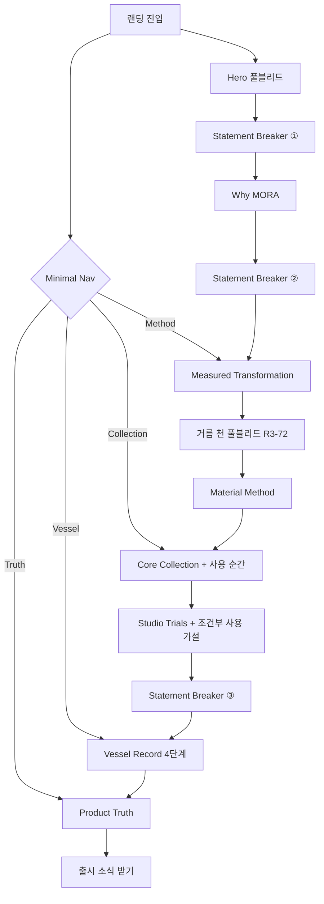

# MORA 브랜드 랜딩페이지 — UX Flow

> Niksen의 큼지막한 에디토리얼 레이아웃을 기본 문법으로 삼는다. 풀블리드 이미지 + 짧은 선언 + CTA가 반복되는 리듬. 복잡한 인터랙션보다 큰 이미지와 여백으로 말한다.

## Niksen에서 가져오는 핵심 원칙

Niksen 랜딩은 9개 섹션이 모두 같은 리듬이다:

1. **풀블리드 이미지** (뷰포트 전체)
2. **대형 타이틀 + 1-2줄 서사** (설명이 아니라 태도)
3. **CTA 하나**
4. **다음 풀블리드로 넘어감**

이 리듬을 MORA의 8개 섹션에 그대로 적용한다. 각 섹션이 하나의 "풀블리드 에디토리얼 스프레드"가 된다. 탭/캐러셀/sticky scroll 같은 복잡한 인터랙션은 최소화하고, 스크롤만으로 읽히는 구조를 우선한다.

## 유저 시나리오

### 시나리오 1: 첫 방문 — 스크롤 한 번으로 브랜드 이해

- **사용자**: MORA를 처음 접하는 잠재 소비자
- **목표**: "이 요거트가 왜 다른가"를 스크롤만으로 이해
- **플로우**:
  1. Hero 풀블리드 — 빈 공방 전경 + "재료가 머무는 방식까지 보이는 한 컵"
  2. Statement Breaker — 브랜드 메시지 한 줄
  3. Why MORA — 메이커 사진 + 출발 질문 + 4가지 밸류
  4. Statement Breaker — "우유가 몸을 얻고, 재료가 결을 남기는 순서"
  5. Measured Transformation — 8단계를 큰 이미지와 짧은 캡션으로 세로 스크롤
  6. 거름 천 풀블리드 전환 (R3-72)
  7. Material Method — 6재료를 큰 이미지 카드로 비교
  8. Core Collection — 4제품 큰 카드 + 사용 순간 2장
  9. Studio Trials — 2제품 조건부 카드 + 저녁 사용 가설 1장
  10. Statement Breaker — "라벨 대신, 한 컵의 기록을 유리에"
  11. Vessel Record — SEE/READ/OPEN/TASTE 4장 세로 스크롤
  12. Product Truth — 감각/사실 분리
  13. 뉴스레터 CTA + 에칭 시그네처
- **성공 조건**: 스크롤 한 번, 중단 없이 Product Truth까지 도달
- **예외 상황**: 없음 (복잡한 인터랙션 없이 정적 레이아웃으로도 완전히 작동)

### 시나리오 2: 특정 제품 비교

- **사용자**: 재방문자
- **플로우**: Nav "Collection" 클릭 → Core Collection 앵커 → 4개 카드 비교 → Product Truth 확인
- **성공 조건**: 내부 흔적 차이를 이미지로 즉시 구분

### 시나리오 3: 파트너 공유

- **사용자**: 유통/투자 관계자
- **플로우**: URL → Hero → Vessel Record → Product Truth → Studio Trials
- **성공 조건**: 단일 URL로 포지셔닝 설명 완결

## UX 플로우



## 정보 구조 (IA)

Niksen처럼 단일 페이지, 세로 스크롤, 풀블리드 반복. 깊은 중첩 없음.

```
MORA Landing
│
├── Minimal Nav (고정)
│   MORA · Collection · Method · Vessel · Truth
│
├── Hero 풀블리드
│   ST3-HERO-EMPTY-ATELIER-40 (16:9)
│   + 좌측 카피 오버레이
│
├── Statement Breaker ① — "한 컵 안에, 재료가 머문 결."
│
├── Why MORA
│   좌 5: 출발 질문 + 4 밸류 (세로 나열, 탭 아님)
│   우 7: ST3-WHY-MORA-MAKER-41 + 에칭 R2-43
│
├── Statement Breaker ② — "우유가 몸을 얻고, 재료가 결을 남기는 순서."
│
├── Measured Transformation
│   8단계를 큰 이미지+캡션 세로 반복
│   에칭 R2-42, R2-45 + 공정 METHOD-R2-52
│   마지막: 거름 천 풀블리드 R3-72
│
├── Material Method
│   4장 실험 프레임 (METHOD-R2-52~55) 큰 그리드
│   6재료 큰 카드 세로 나열 (ingredient aerial + 에칭)
│
├── Core Collection — "Vol. 1 — 네 가지 결"
│   4제품 큰 카드 (정면 유리 + 이름 + USP)
│   클릭 시 펼침: 원재료 aerial + Material Folio
│   하단: 사용 순간 R3-69(아침) + R3-70(오후)
│
├── Studio Trials — "다음 Vol.의 후보"
│   2제품 카드 (desaturated + 상태 뱃지)
│   하단: 조건부 사용 가설 R3-71(저녁)
│
├── Statement Breaker ③ — "라벨 대신, 한 컵의 기록을 유리에."
│
├── Vessel Record
│   SEE: R2-56 (닫힌 유리 정면)
│   READ: R2-65 (검수 정면)
│   OPEN: R2-58 → R2-57 (closure → open)
│   TASTE: R2-67 → R3-68 (개봉 → 첫 스푼 매크로)
│   각 단계가 풀블리드 한 장씩, Niksen 리듬 그대로
│
├── Product Truth
│   좌: 감각 카피 + R2-65 이미지
│   우: 확인된 사실 (원재료, 중량, 보관)
│   하단: 사실 뱃지 (냉장 / 150g / 유리 용기)
│
├── Newsletter CTA + 에칭 시그네처
│
└── Footer
    MORA · 법적 고지 · SNS
```

## 데이터 모델

| 엔티티 | 주요 필드 | 관계 |
|--------|----------|------|
| `Product` | `id`, `name`, `eyebrow`, `headline`, `usp`, `launchRole` (core/trial), `productImageId`, `ingredientImageId`, `etchingImageId`, `momentImageId?` | 1:N Asset |
| `Asset` | `id`, `filePath`, `alt`, `aspectRatio`, `section` | N:1 Section |
| `Section` | `order`, `name`, `headline`, `bodyCopy`, `cta`, `assetIds[]` | 1:N Asset |
| `StatementBreaker` | `position`, `imageId`, `statement` | 1:1 Asset |
| `BrandValue` | `name`, `launchCopy`, `proofText` | Why MORA 소속 |
| `ProcessStep` | `step`, `label`, `method`, `tool`, `output` | Transformation 소속 |
| `VesselPhase` | `phase` (SEE/READ/OPEN/TASTE), `assetId`, `description` | Vessel Record 소속 |

## 컴포넌트 리스트

Niksen 레이아웃의 핵심은 반복되는 몇 가지 큰 블록이다. 같은 블록을 콘텐츠만 바꿔 반복한다.

### 기본 블록 (사이트 전체 반복)

| 컴포넌트 | 용도 | 구분 | Niksen 근거 |
|----------|------|------|------------|
| `FullBleedSection` | 풀뷰포트 이미지 + 카피 오버레이. 모든 섹션의 기본 단위 | 신규 | Niksen 전 섹션의 기본 구조: Hero/Feature/Collab/Collection 모두 동일 리듬 |
| `StatementBreaker` | 어두운 오버레이 풀블리드 + 브랜드 메시지 한 줄. 대챕터 전환 | 신규 | Niksen #06 Collection Statement: "begins with a wish to return to the source" |
| `MoraNav` | 고정 상단. MORA + 4링크. 스크롤 시 배경 전환 | 신규 | Niksen 미니멀 네비 |
| `EtchingDivider` | 소전환용 SVG 1px draw-in | 신규 | Niksen 라인 드로잉 시그네처를 MORA 에칭으로 번역 |

### 섹션별 블록

| 컴포넌트 | 용도 | 구분 | Niksen 근거 |
|----------|------|------|------------|
| `HeroCopyOverlay` | Hero 좌측 38-42%에 eyebrow + headline + support + 2 CTA | 신규 | Niksen Hero: 대형 H1 + 서브카피 + CTA |
| `SplitEditorial` | 비대칭 2컬럼 (5:7). Why MORA, Product Truth 공용 | 신규 | Niksen Shop the Look 좌우 분할 |
| `ValueList` | 4개 밸류 세로 나열. 탭 아님, 리스트 | 신규 | Niksen 최소 정보 원칙: 복잡한 UI 대신 직접 나열 |
| `ProcessScroll` | 8단계를 큰 이미지+캡션으로 세로 반복 | 신규 | Niksen 세로 스크롤 리듬 |
| `ProductCard` | 큰 제품 이미지 + eyebrow + 이름 + USP. 클릭 시 펼침 | 신규 | Niksen 최소 정보 카드 + Shop the Cup 분해 (N-01) |
| `ProductExpander` | 펼침 시 원재료 aerial + Material Folio | 신규 | Niksen Shop the Look: 전체→부분 역분해 |
| `ConditionalCard` | ProductCard 변형. saturate(0.9) + 상태 뱃지 | 신규 | Niksen Vol. 넘버링, "다음 Vol.의 후보" (N-03) |
| `UseMomentCard` | 사용 순간 이미지 + 시간대 라벨 + 제품명 | 신규 | Niksen Walking Capsule 행위 중심 + Moment Capsule (N-02) |
| `VesselPhaseBlock` | Vessel Record 한 단계. 풀블리드 이미지 + phase 라벨 | 신규 | Niksen 풀블리드 반복 리듬 4회 적용 |
| `FactBadge` | 확인된 사실 수평 뱃지 (냉장/150g/유리) | 신규 | Niksen 최소 정보 |
| `NewsletterCTA` | "출시 소식 받기" + 이메일 입력 + 에칭 시그네처 | 신규 | Niksen #09: 라인 드로잉 + "Join the family" |

### 총계

| 구분 | 수량 |
|------|------|
| 신규 | 15 |
| 수정 | 0 |
| 재활용 | 0 |
| **합계** | **15** |

핵심 4개: `FullBleedSection`, `StatementBreaker`, `ProductCard`, `UseMomentCard`가 전체 리듬을 만든다. 나머지는 이 4개의 변형이거나 보조 블록이다.

---

**Phase 2 작성 완료.** `docs/mora-landing-page/02-ux-flow.md`

승인 또는 수정 요청을 해 주시면 Phase 3(Visual Direction)으로 진행하겠습니다.
