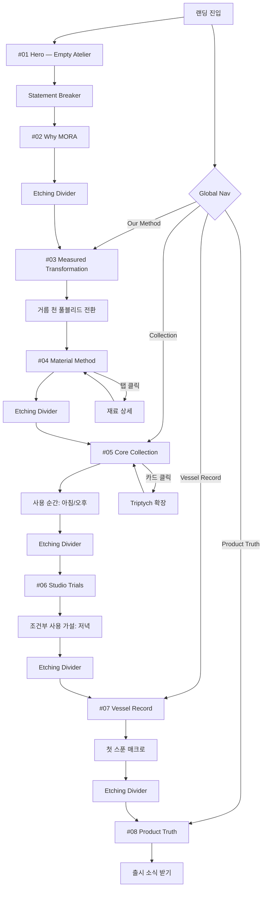

# MORA 브랜드 랜딩페이지 — UX Flow

## 유저 시나리오

### 시나리오 1: 첫 방문자의 브랜드 이해

- **사용자**: MORA를 처음 접하는 잠재 소비자
- **목표**: "이 요거트가 왜 다른가"를 스크롤 한 번으로 이해하고 관심 제품을 특정한다
- **플로우**:
  1. 랜딩 진입 → Hero에서 빈 아틀리에와 "재료가 머무는 방식까지 보이는 한 컵" 확인
  2. Why MORA에서 메이커가 비교하는 세 상태 관찰 → 4가지 밸류 탭으로 차이 이해
  3. Measured Transformation 스크롤 → 8단계 공정 캐러셀 → 거름 천 풀블리드 전환
  4. Material Method에서 관심 재료 탭 클릭 → aerial/folio 이미지와 물성 비교
  5. Core Collection에서 4제품 Triptych 탐색 + 사용 순간 이미지로 맥락 확인
  6. Vessel Record 4-phase sticky로 패키지 개봉 경험 체감
  7. Product Truth에서 확인 가능한 사실만 읽음
  8. CTA "출시 소식 받기" 또는 Nav로 관심 섹션 재탐색
- **성공 조건**: 첫 스크롤에서 이탈하지 않고 Core Collection까지 도달
- **예외 상황**: 모바일에서 sticky/parallax가 과도하면 fallback 정적 레이아웃 전환

### 시나리오 2: 특정 제품 비교

- **사용자**: 이미 MORA를 알고 있는 재방문자
- **목표**: Thyme Honey와 Black Sesame 중 선택
- **플로우**:
  1. Nav에서 "Collection" 클릭 → Core Collection 섹션 앵커 이동
  2. 두 제품의 Triptych 카드를 각각 확장 → 정면 유리/원재료/에칭 비교
  3. 사용 순간(아침 vs 오후) 이미지로 맥락 차이 확인
  4. Product Truth로 이동 → 확인된 사실(중량, 알레르겐) 점검
- **성공 조건**: 두 제품의 내부 흔적과 맥락 차이를 시각적으로 구분
- **예외 상황**: 없음

### 시나리오 3: 파트너/투자자 공유

- **사용자**: 유통/투자 관계자
- **목표**: 브랜드 포지셔닝과 제품 차별화 근거를 빠르게 파악
- **플로우**:
  1. URL 수신 → Hero에서 공방 이미지로 제조 기반 브랜드임을 인지
  2. Why MORA에서 출발 질문과 4가지 원칙 확인
  3. Vessel Record에서 패키징 차별화 확인
  4. Product Truth에서 검증 경계(미확인 항목 포함) 확인
  5. Studio Trials에서 파이프라인 깊이(조건부 제품 2종) 확인
- **성공 조건**: 단일 URL로 포지셔닝 설명이 완결
- **예외 상황**: 없음

## UX 플로우



## 정보 구조 (IA)

```
MORA Landing Page
├── Global Nav (fixed)
│   ├── MORA 로고
│   ├── Collection → #05 앵커
│   ├── Our Method → #03 앵커
│   ├── Vessel Record → #07 앵커
│   └── Product Truth → #08 앵커
│
├── #01 Hero — Empty Atelier
│   ├── Eyebrow: MORA INFUSED GREEK YOGURT
│   ├── Headline: 재료가 머무는 방식까지 보이는 한 컵.
│   ├── Support Copy
│   ├── Primary CTA: 여섯 가지 결 보기 → #05
│   └── Secondary CTA: 만드는 순서 보기 → #03
│
├── [Statement Breaker — 선택]
│
├── #02 Why MORA — Founding Question
│   ├── SplitLayout 5:7
│   │   ├── TextColumn
│   │   │   ├── Section Label: THE FOUNDING QUESTION
│   │   │   ├── Headline: 무엇을 더할지보다, 무엇을 남길지.
│   │   │   ├── Body Copy
│   │   │   └── ValueGrid (4-pillar 탭)
│   │   │       ├── 보이는 재료성
│   │   │       ├── 측정된 변환
│   │   │       ├── 차분한 정확성
│   │   │       └── 짧은 머묾
│   │   └── ImageColumn
│   │       ├── ST3-WHY-MORA-MAKER-41
│   │       └── EtchingParallax (R2-43 first-furrow)
│   └── CTA: MORA의 출발 질문 읽기
│
├── [Etching Divider]
│
├── #03 Measured Transformation
│   ├── StickyContainer (300vh)
│   │   ├── ProgressRail (좌측 세로선 + 8 도트)
│   │   └── StickyFrame
│   │       ├── StepRenderer (8단계 sticky 전환)
│   │       │   ├── Step 1-4: 에칭 R2-42 + 공정 이미지
│   │       │   ├── Step 5: 에칭 R2-45 cloth-to-body 오버레이
│   │       │   ├── Step 6-7: METHOD-R2-52 aerial
│   │       │   └── Step 8: Glass Vessel → Seal
│   │       └── EtchingOverlay (Step 5 슬라이드인)
│   └── FullBleedTransition: ST3-TRANSITION-R3-72 (거름 천 aerial)
│
├── #04 Material Method
│   ├── Headline: 모든 재료가 같은 방식으로 머물지는 않습니다.
│   ├── ExperimentalFrameGrid (METHOD-R2-52~55, 2x2)
│   ├── TabCarousel (6 재료)
│   │   ├── 각 탭: ingredient aerial → etching folio (crossfade)
│   │   └── 호버 시: Material Folio 20% opacity 배경
│   └── CTA: 재료별 방식 보기
│
├── [Etching Divider]
│
├── #05 Core Collection
│   ├── SectionHeader
│   │   ├── Eyebrow: CORE COLLECTION
│   │   └── Headline: 같은 유리, 서로 다른 네 가지 결.
│   ├── ProductTriptychGrid (4 제품)
│   │   ├── Thyme Honey: 59→19→R2-46
│   │   ├── Roasted Buckwheat: 61→21→R2-48
│   │   ├── Citrus Peel: 62→22→R2-49
│   │   └── Black Sesame: 63→23→R2-50
│   │   각 카드: Eyebrow(HERBAL/CORE 01) + 제품명 + USP + 감각 태그
│   │   클릭 시: Triptych 3장 확장 (정면→원재료→에칭)
│   ├── UseMomentStrip
│   │   ├── R3-69: 아침 — Thyme Honey + 커피
│   │   └── R3-70: 오후 — Roasted Buckwheat + 책
│   └── CTA: Core Collection 비교하기
│
├── [Etching Divider]
│
├── #06 Studio Trials
│   ├── SectionHeader
│   │   ├── Eyebrow: STUDIO TRIALS
│   │   └── Headline: 제품이 되기 전의 두 가지 방향.
│   ├── ConditionalTriptychGrid (2 제품)
│   │   ├── Fig Leaf: 60→20→R2-47 + SAFETY REVIEW 뱃지
│   │   └── Olive Oil & Sea Salt: 64→24→R2-51 + STABILITY TESTING 뱃지
│   │   CSS filter: saturate(0.9), dashed border
│   ├── ConditionalMomentCard
│   │   └── R3-71: 저녁 — Olive Oil & Sea Salt + 빵 (Studio Trial 표기)
│   └── CTA: Studio Trials 개발 기준 보기
│
├── [Etching Divider]
│
├── #07 Vessel Record
│   ├── StickyContainer (400vh)
│   │   ├── Phase 1 "SEE": R2-56 master (닫힌 유리 정면)
│   │   ├── Phase 2 "READ": R2-65 inspection front + SVG draw-in 오버레이
│   │   ├── Phase 3 "OPEN": R2-58 closure → R2-57 open service (crossfade)
│   │   └── Phase 4 "TASTE": R2-67 customer peel+spoon → R3-68 macro (확대)
│   │   PhaseLabel 우측 고정: SEE → READ → OPEN → TASTE
│   └── CTA: Vessel Record 경험 보기
│
├── [Etching Divider]
│
├── #08 Product Truth
│   ├── SplitScroll
│   │   ├── 좌측 (감각): 감각 카피, 제품 사진 R2-65
│   │   └── 우측 (사실): 확인된 원재료, 알레르겐, 중량, 보관, 소비기한
│   ├── FactBadgeRow: 냉장 / 150g / 유리 용기
│   └── CTA: 출시 소식 받기
│
└── Footer
    ├── MORA 로고
    ├── 법적 고지
    └── SNS 링크
```

## 데이터 모델

프론트엔드 관점의 상태와 엔티티 구조다. 백엔드 없이 정적 데이터로 구동한다.

| 엔티티 | 주요 필드 | 관계 |
|--------|----------|------|
| `Product` | `id`, `name`, `eyebrow`, `headline`, `usp`, `sensoryTag`, `launchRole` (`core` / `studio_trial`), `cta`, `productImageId`, `ingredientImageId`, `etchingImageId`, `momentImageId?` | 1:1 Triptych, 0..1 Moment |
| `Asset` | `id`, `filePath`, `alt`, `aspectRatio`, `role`, `section` | N:1 Section |
| `Section` | `order`, `name`, `eyebrow`, `headline`, `bodyCopy`, `cta`, `assetIds[]` | 1:N Asset |
| `BrandValue` | `name`, `launchCopy`, `proofText` | belongs to Why MORA |
| `ProcessStep` | `stepNumber`, `label`, `method`, `tool`, `output`, `assetId?`, `etchingId?` | belongs to Transformation |
| `VesselPhase` | `phase` (SEE/READ/OPEN/TASTE), `label`, `assetId`, `description` | belongs to Vessel Record |
| `FactItem` | `category`, `label`, `value`, `verified` | belongs to Product Truth |

## 컴포넌트 리스트

기존 Starter Kit의 brand-documentation 컴포넌트는 Storybook 보고서용이므로 랜딩페이지에는 직접 재활용하지 않는다. 모든 랜딩 컴포넌트는 신규 제작이며, 기존 taxonomy-index의 패턴 어휘를 참조해 카테고리를 배정한다.

### Global / Layout

| 컴포넌트 | 용도 | 구분 | 레퍼런스 근거 | 카테고리 |
|----------|------|------|-------------|---------|
| `MoraNav` | 고정 상단 네비게이션. 스크롤 > 100px 시 배경 전환, 1px 프로그레스 바 | 신규 | SOM 고정 상단 + ARENSBAK 미니멀 3링크 + Measured 그리드 네비 | Navigation (Global) |
| `MoraSection` | 공통 섹션 래퍼. padding 64px 0, #F5F1E8 배경, 65-70% 여백 규칙 적용 | 신규 | Field Studies Flora 넓은 여백 + 보타니컬 에디토리얼 공백 | Layout |
| `EtchingDivider` | 섹션 간 SVG path draw-in 디바이더. 좌→우 0.8s ease | 신규 | Chartogne-Taillet 에칭 라인워크 + 빈야드 탐색 인터랙션 | Container / Separator |
| `StatementBreaker` | 풀블리드 이미지 + 한 줄 선언 텍스트 오버레이. 섹션 전환점 삽입 | 신규 | Niksen N-04 풀블리드 선언 구조 | Layout / Hero variant |
| `StickyScrollContainer` | GSAP ScrollTrigger 기반 sticky 프레임 + 스크롤 진행도 연동 컨테이너 | 신규 | Olicatessen 7단계 수평 캐러셀 + SOM 4-phase sticky | Scroll / ContentTransition |

### #01 Hero

| 컴포넌트 | 용도 | 구분 | 레퍼런스 근거 | 카테고리 |
|----------|------|------|-------------|---------|
| `HeroSection` | 16:9 풀블리드 아틀리에 이미지 + 좌측 38-42% 카피 오버레이 영역 | 신규 | Niksen Hero(풀블리드 공방 + 대형 H1 + 한 줄 서사) + Olicatessen "An Ancestral Gift" 서사 우선 Hero + SOM copy-safe 좌측 배치 | Layout / Hero |
| `HeroCopyOverlay` | Eyebrow + Headline + SupportCopy + 2 CTA. 반투명 배경 없이 텍스트만 | 신규 | SOM 즉시 노출 구조 | Typography |

### #02 Why MORA

| 컴포넌트 | 용도 | 구분 | 레퍼런스 근거 | 카테고리 |
|----------|------|------|-------------|---------|
| `SplitLayout` | 비대칭 2컬럼 (텍스트 5 : 이미지 7). 모바일에서 스택 | 신규 | ARENSBAK 5단계 아코디언 브랜드 철학 레이아웃 | Layout / SplitScreen |
| `ValueTabGrid` | 4개 밸류 카드 탭 전환. 클릭 시 proof 텍스트 확장, 한 번에 하나만 열림 | 신규 | Bearaby 3-pillar 밸류 탭(Weight/Cool/Comfort) 전환 + 통계 디스플레이(85%/60% 대형 숫자) | In-page Navigation / Tabs |
| `EtchingParallax` | 두 에칭 이미지가 서로 다른 속도(0.8x, 1.2x)로 스크롤 | 신규 | Chartogne-Taillet 에칭 스타일 빈야드 지도 + 도트 트랜지션 인터랙션 | Scroll / Parallax |

### #03 Measured Transformation

| 컴포넌트 | 용도 | 구분 | 레퍼런스 근거 | 카테고리 |
|----------|------|------|-------------|---------|
| `ProgressRail` | 좌측 세로선 + 8개 도트. 현재 스텝 활성 표시 | 신규 | Olicatessen 7단계 수평 캐러셀 공정(harvest→bottled) 진행 표시를 세로로 전환 | Data Display / Steps |
| `ProcessStepRenderer` | sticky 프레임 안에서 스텝별 이미지+도구+산출물 전환. 데스크톱 sticky, 모바일 아코디언 | 신규 | Olicatessen 수평 캐러셀 + ARENSBAK 아코디언식 5단계 공정(tea→ferment→bottle) 폴백 | ContentTransition / PinnedContentSwap |
| `ProcessEtchingOverlay` | Step 5에서 cloth-to-body 에칭이 우측에서 슬라이드인 | 신규 | Chartogne-Taillet 에칭 스타일 탐색 + 빈야드 hover 시 도트 정보 공개 인터랙션 | Motion / FadeTransition |
| `ClothTransitionBreaker` | `ST3-TRANSITION-R3-72` 풀블리드. Transformation 종료 → Material Method 시작 연결 | 신규 | Niksen N-04 Statement Breaker 풀블리드 선언 구조 | Layout |

### #04 Material Method

| 컴포넌트 | 용도 | 구분 | 레퍼런스 근거 | 카테고리 |
|----------|------|------|-------------|---------|
| `ExperimentalFrameGrid` | R2 method 4장(52-55)을 2x2 그리드로 배치. 55% 이상 여백 유지 | 신규 | 직접 관찰 없음 — S3 Material Method 규칙(오브제 45% 이하, 여백 55% 이상) 적용 | Layout / Grid |
| `IngredientTabCarousel` | 6재료 탭. 클릭 시 ingredient aerial → etching folio crossfade. 호버 시 Material Folio 20% opacity 배경 등장 | 신규 | Graza 사용법 탭(Sear/Fry/Grill/Roast/Bake/Garnish/Knead) 클릭 시 레시피 이미지 전환 + Chartogne-Taillet 빈야드 호버 시 배경 정보 공개 + NON 재료별 독립 프로필 카드 | In-page Navigation / Tabs + Media / Gallery |

### #05 Core Collection

| 컴포넌트 | 용도 | 구분 | 레퍼런스 근거 | 카테고리 |
|----------|------|------|-------------|---------|
| `ProductTriptychCard` | 제품 카드. Eyebrow(HERBAL/CORE 01) + 제품명 + USP + 감각 태그. 클릭 시 3장 확장(정면→원재료→에칭) | 신규 | NON 넘버링(NON1~NON9) + Le Labo식 제품 구조 + Measured 카테고리 태그+제품명 에디토리얼 카드 + Graza 맛 프로필 태그(Punchy/Mellow/Neutral) 카드 + JNPR 감각 형용사+넘버링(n1/n3) | Card / ExpandingCard |
| `TriptychExpander` | 카드 확장 시 3장 수평 또는 수직 스크롤. 정면 유리→원재료 aerial→Material Folio 순서 고정 | 신규 | Gelee 제품-라이프스타일 교차 배치 리듬 + Dix Hectares 호버 시 배경 이미지 교체 | Media / Gallery |
| `UseMomentStrip` | Triptych 아래 2장 수평 배치. 시간대 라벨 + 제품 + 맥락 오브제 | 신규 | Niksen N-02 "Walking Capsule" 사용 순간 캡슐 구조 + Gelee 제품-라이프스타일 교차 리듬 | Card / MediaCard |

### #06 Studio Trials

| 컴포넌트 | 용도 | 구분 | 레퍼런스 근거 | 카테고리 |
|----------|------|------|-------------|---------|
| `ConditionalProductCard` | `ProductTriptychCard` 변형. saturate(0.9) + dashed border + status badge | 신규 | SOM LAB 연구/제조 아티클 카드 에디토리얼 스타일 + ARENSBAK 검증 프로세스 공개(fermentation/terroir) | Card / OutlinedCard |
| `StatusBadge` | "SAFETY REVIEW" / "STABILITY TESTING" 텍스트 뱃지 | 신규 | JNPR 인증 뱃지 행(sans alcool/sans sucre/vegan) | Data Display / Badge |
| `ConditionalMomentCard` | R3-71 저녁 장면 + "Studio Trial 사용 가설" 명시 라벨 | 신규 | Niksen N-02 Moment Capsule 조건부 변형 | Card / MediaCard |

### #07 Vessel Record

| 컴포넌트 | 용도 | 구분 | 레퍼런스 근거 | 카테고리 |
|----------|------|------|-------------|---------|
| `VesselPhaseRenderer` | 4-phase sticky scroll. 스크롤 진행(0-100%)에 따라 이미지 crossfade + 우측 PhaseLabel 전환 | 신규 | Dix Hectares 호버 시 와인 배경 이미지 교체 인터랙션을 스크롤 기반으로 전환 + SOM RITUALS 사용 맥락 카드 스크롤 전환(FOCUS/LONG DAYS/START OF DAY) | ContentTransition / PinnedContentSwap |
| `PhaseLabel` | 우측 고정. SEE → READ → OPEN → TASTE 순차 활성. 현재 phase 강조 | 신규 | SOM 섹션 라벨 + Olicatessen 공정 단계 라벨 | Data Display / Steps |
| `SVGDrawInOverlay` | Phase 2에서 vessel-record-print-spec.svg의 path를 stroke-dasharray 애니메이션으로 그려넣음 | 신규 | Chartogne-Taillet WebGL canvas의 에칭 라인워크를 SVG 애니메이션으로 단순화 | Motion / ScrollScrubbing |
| `SpoonMacroZoom` | Phase 4 마지막에 R3-68 첫 스푼 매크로로 확대 전환 | 신규 | Niksen N-01 "Shop the Cup" 분해 구조의 마지막 클로즈업 | Media / Image + Motion |

### #08 Product Truth

| 컴포넌트 | 용도 | 구분 | 레퍼런스 근거 | 카테고리 |
|----------|------|------|-------------|---------|
| `SenseSplitLayout` | 좌측 감각 카피 + 우측 사실 정보가 서로 다른 속도로 스크롤 | 신규 | SOM RITUALS 좌우 분리 스크롤 + Cabi Foods Kaizen Log 감각/성분 정보 물리적 분리 구조 | Layout / SplitScreen + Scroll |
| `FactBadgeRow` | 확인된 사실만 수평 뱃지로 나열 (냉장 / 150g / 유리 용기) | 신규 | JNPR 인증 뱃지 행(sans alcool/sans sucre/vegan/sans gluten) + Bearaby 통계 리뷰 구조 | Data Display / Badge |
| `NewsletterCTA` | "출시 소식 받기" 이메일 입력 + 제출 버튼 | 신규 | Olicatessen Newsletter CTA | Input & Control / Form |

### #09 Etching System (Global)

| 컴포넌트 | 용도 | 구분 | 레퍼런스 근거 | 카테고리 |
|----------|------|------|-------------|---------|
| `EtchingBackgroundLayer` | Hero/Why MORA/Closing에서 에칭을 5-8% opacity로 배경에 깔아 브랜드 톤 유지 | 신규 | Chartogne-Taillet 크림/카본 에칭 톤 + Field Studies Flora 보타니컬 에디토리얼 넓은 여백 65-70% 규칙 | DynamicColor / AmbientBackground |

### #10 Nav (위 Global에 포함)

### #11 Comparison Matrix (선택)

| 컴포넌트 | 용도 | 구분 | 레퍼런스 근거 | 카테고리 |
|----------|------|------|-------------|---------|
| `SixProductMatrix` | 6열 매트릭스. 호버 열만 full opacity, 나머지 dim. 클릭 시 Triptych 확장 | 신규 | NON NON1~NON9 수평 제품 레인지 + 식사 페어링 카드 스크롤 전환 + Dix Hectares 호버 시 배경 교체 인터랙션 | Data Display / Table + Motion |

### 컴포넌트 총계

| 구분 | 수량 |
|------|------|
| 신규 | 25 |
| 수정 | 0 |
| 재활용 | 0 |
| **합계** | **25** |

---

**Phase 2 작성 완료.** `docs/mora-landing-page/02-ux-flow.md`

승인 또는 수정 요청을 해 주시면 Phase 3(Visual Direction)으로 진행하겠습니다.
